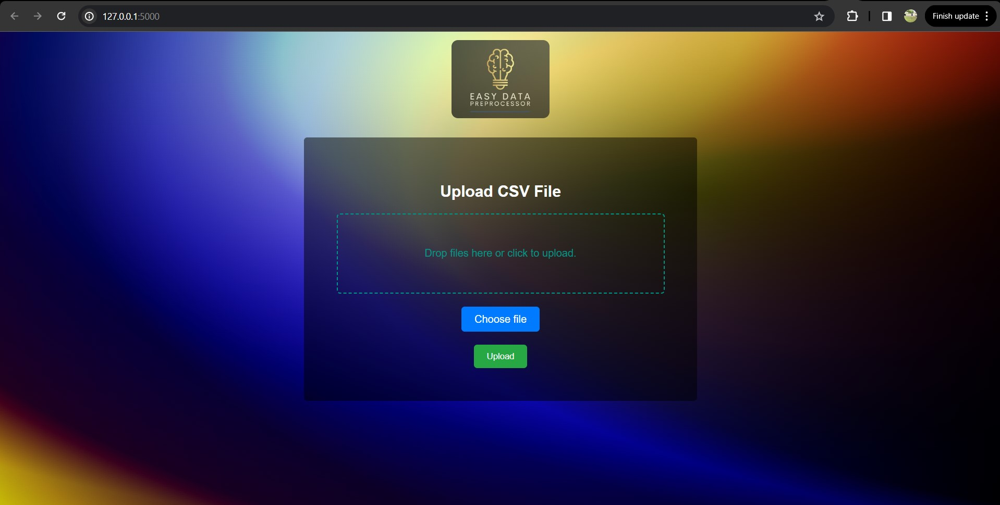
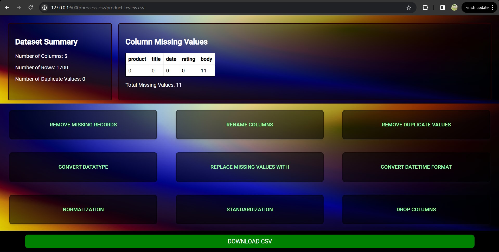

# pandas_Data_Preprocessor

Pandas_Data_Preprocessor! This interactive web application simplifies the process of manipulating CSV files using a user-friendly interface. Without writing a single line of code, users can perform various pandas operations on their CSV files and download the processed files with ease. Our tool leverages Flask for web hosting and combines the power of Pandas with HTML, CSS, and JavaScript to deliver a seamless experience.

## Features
Upload CSV Files: Users can easily upload their CSV files to the web application.
Perform Pandas Operations: Through our intuitive UI, perform various operations like sorting, filtering, column operations, and more.
Download Processed Files: After processing, the modified CSV files can be downloaded with just a click.

## Upload Page

## Main Page

